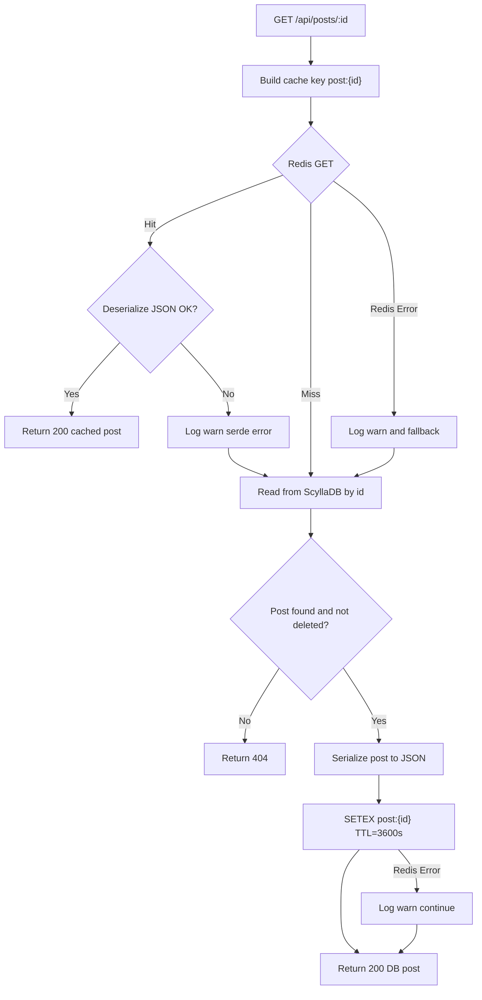

# Post Redis Cache Plan (Senior Review)

## 1. Objective
Implement a distributed caching layer for Post read paths using Redis to reduce ScyllaDB load and improve p95 read latency, with graceful degradation when Redis is unavailable.

Target outcomes:
- Reduce hot-path Scylla reads for `GET /api/posts/:id`
- Keep correctness on `PUT`/`DELETE` via explicit invalidation
- Never fail API requests only because cache is down

---

## 2. Senior Review Findings (Current State)

1. Route/version mismatch in proposal.
- Current routes are `/api/posts/...` (not `/api/v1/posts/...`) in [`src/presentation/routes/mod.rs`](/home/nhitran/RustApps/axum_backend/src/presentation/routes/mod.rs:218).
- Plan should use existing route prefix unless versioning refactor is included.

2. Existing cache abstraction already exists.
- Project already has `CacheRepository` + Redis cluster implementation in [`src/infrastructure/cache/mod.rs`](/home/nhitran/RustApps/axum_backend/src/infrastructure/cache/mod.rs:22) and [`src/infrastructure/cache/redis_cache.rs`](/home/nhitran/RustApps/axum_backend/src/infrastructure/cache/redis_cache.rs:77).
- Do not bypass it with handler-level `redis::cmd(...)` as primary approach.

3. Redis crate features are already correctly enabled.
- `redis` uses `tokio-comp` + `cluster-async` in [`Cargo.toml`](/home/nhitran/RustApps/axum_backend/Cargo.toml:101).

4. Current Post routes are fully behind auth middleware.
- In [`src/presentation/routes/posts.rs`](/home/nhitran/RustApps/axum_backend/src/presentation/routes/posts.rs:36), auth middleware wraps all endpoints.
- If read-heavy public access is desired, route split is required; otherwise cache still helps authenticated read traffic.

5. Post queries still have expensive patterns (`ALLOW FILTERING`) in Scylla models.
- Caching will reduce pressure, but query-model refactor is still needed for long-term scale.

---

## 3. Infrastructure & Configuration

- Cache datastore: Redis Cluster (already supported by `redis-cluster://...` URL parsing).
- Serialization: `serde_json` for `Post` entity payload.
- TTL (initial): `3600s` for Post lookups.
- Eviction policy assumption: Redis `volatile-lru` at infrastructure level.

No new crate is required for MVP cache integration.

---

## 4. Caching Strategy (Read-Aside + Invalidation)

### 4.1 Key Taxonomy
| Data Type | Key | TTL |
|---|---|---|
| Post by ID | `post:{id}` | 3600s |
| Post by Slug | `post:slug:{slug}` | 3600s |

Notes:
- `post:slug:{slug}` is optional for phase 1 (useful once `GET by slug` is added).
- Keep key format centralized in helper functions to avoid drift.

### 4.2 Read Path (`GET /api/posts/:id`)
1. Build cache key `post:{id}`.
2. `cache.get(key)`.
3. Cache hit:
- Deserialize JSON to `Post`.
- Return immediately.
4. Cache miss or cache error:
- Read from Scylla via `PostRepository::find_by_id`.
- If found and not deleted, serialize and `cache.set(key, value, 3600s)`.
- Return DB result.

### 4.3 Mutation Path (`PUT`, `DELETE`)
After successful Scylla mutation:
1. Delete `post:{id}`.
2. Delete `post:slug:{slug}` when slug is known.

For update with title change:
- Invalidate both old slug key and new slug key (defensive).

---

## 5. Resilience & Fallback Rules

All cache operations are fail-soft:
- On `CacheError`, log `warn!` with `post_id`/`key` context.
- Continue to DB path.
- Never return 500 solely due to cache failure.

Behavior contract:
- Cache read failure => continue with DB read.
- Cache write/delete failure => return success if DB operation succeeded.

---

## 6. Design in This Codebase (Implemented)

## 6.1 New use-cases with cache dependency
Introduce cached variants for post read/mutation use-cases using existing `CacheRepository`.

Implemented structs:
- `GetPostUseCase<PR, C>`
- `UpdatePostUseCase<PR, UR, C>`
- `DeletePostUseCase<PR, UR, C>`

Where `C: CacheRepository + ?Sized`.

## 6.2 Helper module
Add helpers in `src/application/use_cases/post/cache.rs`:
- `post_key(id: Uuid) -> String`
- `post_slug_key(slug: &str) -> String`
- `cache_ttl() -> Duration`
- `deserialize_post(...)` / `serialize_post(...)`

## 6.3 Logging
Use structured tracing:
- `debug!` for hit/miss
- `warn!` for cache failures
- include fields: `post_id`, `slug`, `cache_key`, `operation`

---

## 7. Exact File/Function Checklist

### 7.1 Application Layer
- [x] Update [`src/application/use_cases/post/get.rs`](/home/nhitran/RustApps/axum_backend/src/application/use_cases/post/get.rs:5)
  - `GetPostUseCase` add `cache_repository: Arc<C>`
  - Implement read-aside flow and fail-soft behavior
- [x] Update [`src/application/use_cases/post/update.rs`](/home/nhitran/RustApps/axum_backend/src/application/use_cases/post/update.rs:14)
  - Add cache dependency
  - Invalidate `post:{id}` and slug keys after successful update
- [x] Update [`src/application/use_cases/post/delete.rs`](/home/nhitran/RustApps/axum_backend/src/application/use_cases/post/delete.rs:9)
  - Add cache dependency
  - Invalidate keys after successful soft delete
- [x] Add new helper module `src/application/use_cases/post/cache.rs`
  - Key builders + serde helpers + TTL constant
- [x] Update [`src/application/use_cases/post/mod.rs`](/home/nhitran/RustApps/axum_backend/src/application/use_cases/post/mod.rs:1)
  - export cache helper module if needed

### 7.2 Routing/Wiring
- [x] Update [`src/presentation/routes/posts.rs`](/home/nhitran/RustApps/axum_backend/src/presentation/routes/posts.rs:18)
  - Accept `cache_repository: Arc<dyn CacheRepository>`
  - Inject cache into post use-cases
- [x] Update [`src/presentation/routes/mod.rs`](/home/nhitran/RustApps/axum_backend/src/presentation/routes/mod.rs:218)
  - Pass cache repository into `post_routes(...)`

### 7.3 Optional API Strategy Adjustment
- [ ] Decide if `GET /api/posts` and `GET /api/posts/:id` should be public
  - If yes: split auth middleware in `posts.rs` so only write routes require auth

### 7.4 Tests
- [x] Add/extend tests in [`tests/api/post.rs`](/home/nhitran/RustApps/axum_backend/tests/api/post.rs:1)
  - update -> get returns fresh data after mutation
  - delete -> get returns `404` after soft delete
- [x] Add cache fault-injection tests (mock `CacheRepository`) in unit tests
  - verify DB still serves when cache errors

---

## 8. Rollout Plan

Phase 1:
- Implement read-aside for `GET /api/posts/:id` only.
- Add invalidation for `PUT` and `DELETE`.

Phase 2:
- Add cache for slug-based lookup when endpoint exists.
- Consider list-page caching (`posts:list:{status}:{page}:{page_size}`) only after invalidation policy is finalized.

Phase 3:
- Add metrics dashboards (hit rate, miss rate, fallback count, cache errors).

---

## 9. Definition of Done

- `GET /api/posts/:id` uses cache first and falls back safely.
- `PUT`/`DELETE` invalidate related keys.
- No request fails only due to Redis outage.
- Tests cover hit/miss/invalidation/fallback behavior.
- Logs include actionable structured context for cache failures.
- Remaining query-model optimization (`ALLOW FILTERING`) tracked separately from cache scope.

---

## 10. Flowise Flow Integration (Visual Orchestration)
Use a visual flow representation to document the cache decision tree and aid operational debugging.

### 10.1 Purpose
- Represent read-aside logic (`GET /api/posts/:id`) as a visual decision tree.
- Make fallback and invalidation behavior explicit for debugging and operations.
- Support low-friction team onboarding by pairing code path with a flow diagram.

### 10.2 Flow Nodes (Required)
1. `Start` (input: `post_id`)
2. `Build Cache Key` (`post:{id}`)
3. `Redis GET`
4. `Cache Hit?` (decision)
5. `Deserialize JSON` (decision: success/fail)
6. `Return Cached Post` (success path)
7. `Scylla Read` (fallback path)
8. `Post Found?` (decision)
9. `Serialize + Redis SETEX` (best-effort)
10. `Return DB Post`
11. `Return 404`
12. `Log Warning` (for Redis/serde failures)

### 10.3 Mutation Flow Nodes (PUT/DELETE)
1. `Start Mutation`
2. `Write to Scylla`
3. `Write Success?` (decision)
4. `DEL post:{id}`
5. `DEL post:slug:{slug}` (when available)
6. `Return Success`
7. `Return Error`

### 10.4 Validation Criteria
- Flow render imports in Flowise without schema errors.
- Decision branches cover: cache hit, cache miss, cache error, serde error, DB not found.
- Mutation flow explicitly includes post-write invalidation steps.

### 10.5 Mermaid (Redis Cache Read Flow)

